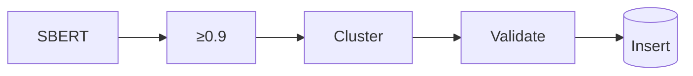

# Tóm tắt  
Bộ dữ liệu cần cân bằng RIASEC/OCEAN (~180 vs 120 mục) và độ tin cậy cao (Cronbach α≥0.7【6†L104-L112】).  

## Thiết kế câu hỏi  
50 đề mục luận chia theo nhóm (ví dụ: Mục tiêu nghề nghiệp, Thử thách, Sáng tạo...) như bảng. Mỗi đề gắn Big5 và RIASEC.  
| Category               | Count |
|------------------------|-------|
| Aspirations & Goals    | 10    |
| Challenges             | 10    |
| Creativity             | 8     |
| Teamwork/Leadership    | 8     |
| Future Planning        | 8     |
| Values/Ethics          | 6     |

Câu trắc nghiệm: RIASEC ~30 mục mỗi loại, OCEAN ~24 mỗi loại (tổng ~300). Khoảng 30% câu đảo chiều (reverse) để giảm bias.  

## Pipeline nạp dữ liệu  
Dùng SBERT embedding + cosine-threshold≈0.9 loại trùng ngữ nghĩa【3†L634-L642】, sau đó clustering. Áp dụng kiểm tra cân bằng trait và luật reverse-score (~30%).  

## Kiểm định chất lượng  
Cronbach α ≥0.7【6†L104-L112】; α >0.95 báo hiệu dư thừa. Loại bỏ câu có hệ số tương quan tổng thấp. Đánh giá Cronbach sau khi thêm/bớt câu.  

## Lựa chọn câu hỏi runtime  
Stratified sampling: chọn cân bằng số câu mỗi trait và tỉ lệ reverse, tránh câu vừa hỏi để đảm bảo đa dạng.  

**Nguồn:** Tiêu chuẩn psychometric (cronbach’s α, item-total)【6†L104-L112】 và hướng dẫn SBERT clustering【3†L634-L642】.