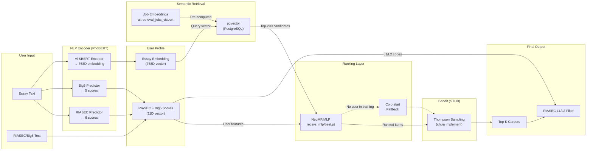
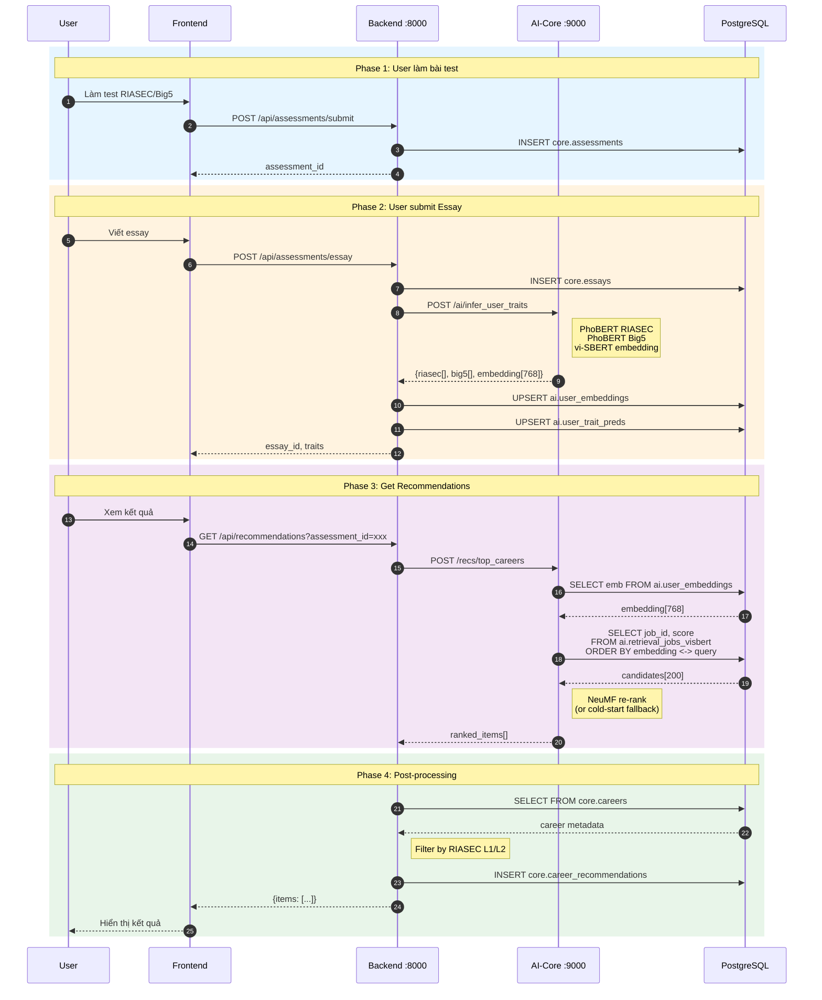

# AI Flow Diagram - Career Recommendation System

## Sơ đồ luồng chạy AI (Cập nhật theo code thực tế)

```mermaid
flowchart TB
    subgraph FE["🖥️ Frontend (React)"]
        UI_INPUT["User Input<br/>(Essay + Test RIASEC/Big5)"]
        UI_RESULTS["Results Page<br/>(Spider Chart + Recommendations)"]
    end

    subgraph BE["⚙️ Backend (FastAPI :8000)"]
        BE_ASSESS["routes_assessments.py<br/>/api/assessments/*"]
        BE_REC["routes_recommendations.py<br/>/api/recommendations"]
        BE_SERVICE["recommendation/service.py<br/>- _call_ai_core_top_careers()<br/>- _filter_by_riasec_top2()<br/>- _attach_career_meta()"]
    end

    subgraph AI["🤖 AI-Core (FastAPI :9000)"]
        direction TB
        
        subgraph TRAITS["📝 Traits Inference"]
            TRAITS_API["routes_traits.py<br/>POST /ai/infer_user_traits"]
            ESSAY_INFER["essay_infer.py<br/>infer_user_traits()"]
            
            subgraph MODELS["PhoBERT Models"]
                RIASEC_MODEL["riasec_phobert/best.pt<br/>→ 6 scores (R,I,A,S,E,C)"]
                BIG5_MODEL["big5_phobert/best.pt<br/>→ 5 scores (O,C,E,A,N)"]
                SBERT["vi_sbert_768/<br/>→ embedding 768D"]
            end
        end
        
        subgraph RECS["🎯 Recommendations"]
            RECS_API["routes_recs.py<br/>POST /recs/top_careers"]
            LOADER["traits/loader.py<br/>load_traits_and_embedding_for_assessment()"]
            
            subgraph RETRIEVAL["📊 Retrieval (B3)"]
                PGVECTOR["service_pgvector.py<br/>search_candidates_for_embedding()"]
            end
            
            subgraph RANKING["🏆 Ranking (B4)"]
                NEUMF["neumf/infer.py<br/>infer_scores()"]
                COLDSTART["Cold-start Fallback<br/>(use retrieval scores)"]
            end
            
            subgraph BANDIT["🎰 Bandit (B5) - STUB"]
                BANDIT_STUB["bandit.py<br/>recommend_with_bandit()<br/>(hiện chỉ sort by rank_score)"]
            end
        end
    end

    subgraph DB["🗄️ PostgreSQL + pgvector"]
        direction LR
        
        subgraph CORE["Schema: core"]
            T_ASSESS["assessments<br/>assessment_sessions<br/>assessment_responses"]
            T_ESSAYS["essays"]
            T_CAREERS["careers<br/>career_riasec_map"]
            T_RECS["career_recommendations"]
        end
        
        subgraph AI_SCHEMA["Schema: ai"]
            T_EMB["user_embeddings<br/>(emb vector(768), source='essay')"]
            T_TRAITS["user_trait_preds<br/>(riasec_pred, big5_pred)"]
            T_JOBS["retrieval_jobs_visbert<br/>(job_id, embedding vector(768))"]
        end
    end

    %% Flow 1: User làm test + Essay
    UI_INPUT -->|"1. Submit Test"| BE_ASSESS
    BE_ASSESS -->|"2. Save responses"| T_ASSESS
    
    UI_INPUT -->|"3. Submit Essay"| BE_ASSESS
    BE_ASSESS -->|"4. Save essay"| T_ESSAYS
    
    %% Flow 2: AI Scoring
    BE_ASSESS -->|"5. POST /ai/infer_user_traits"| TRAITS_API
    TRAITS_API --> ESSAY_INFER
    ESSAY_INFER --> RIASEC_MODEL
    ESSAY_INFER --> BIG5_MODEL
    ESSAY_INFER --> SBERT
    
    TRAITS_API -->|"6. Return traits + embedding"| BE_ASSESS
    BE_ASSESS -->|"7. Save traits"| T_TRAITS
    BE_ASSESS -->|"8. Save embedding"| T_EMB
    
    %% Flow 3: Get Recommendations
    UI_INPUT -->|"9. GET /api/recommendations"| BE_REC
    BE_REC --> BE_SERVICE
    BE_SERVICE -->|"10. POST /recs/top_careers"| RECS_API
    
    %% AI-Core internal flow
    RECS_API --> LOADER
    LOADER -->|"11. Load embedding"| T_EMB
    LOADER --> PGVECTOR
    
    PGVECTOR -->|"12. pgvector similarity search<br/>embedding <=> query"| T_JOBS
    T_JOBS -->|"13. Top-200 candidates"| PGVECTOR
    
    PGVECTOR --> NEUMF
    NEUMF -->|"14a. Re-rank (if user in training)"| BANDIT_STUB
    NEUMF -.->|"14b. Cold-start"| COLDSTART
    COLDSTART -.-> BANDIT_STUB
    
    BANDIT_STUB -->|"15. Final ranked items"| RECS_API
    RECS_API -->|"16. Return items"| BE_SERVICE
    
    %% Post-processing
    BE_SERVICE -->|"17. Join career metadata"| T_CAREERS
    BE_SERVICE -->|"18. Filter by RIASEC L1/L2"| BE_SERVICE
    BE_SERVICE -->|"19. Save recommendations"| T_RECS
    BE_SERVICE -->|"20. Return to FE"| UI_RESULTS

    %% Styling
    classDef frontend fill:#e1f5fe,stroke:#01579b
    classDef backend fill:#fff3e0,stroke:#e65100
    classDef aicore fill:#f3e5f5,stroke:#7b1fa2
    classDef database fill:#e8f5e9,stroke:#2e7d32
    classDef model fill:#fce4ec,stroke:#c2185b
    
    class UI_INPUT,UI_RESULTS frontend
    class BE_ASSESS,BE_REC,BE_SERVICE backend
    class TRAITS_API,ESSAY_INFER,RECS_API,LOADER,PGVECTOR,NEUMF,COLDSTART,BANDIT_STUB aicore
    class RIASEC_MODEL,BIG5_MODEL,SBERT model
    class T_ASSESS,T_ESSAYS,T_CAREERS,T_RECS,T_EMB,T_TRAITS,T_JOBS database
```



## So sánh với sơ đồ gốc

| Thành phần | Sơ đồ gốc | Thực tế (Code) |
|------------|-----------|----------------|
| **Retrieval** | FAISS Index | ❌ **pgvector** (PostgreSQL extension) |
| **Job Embeddings** | FAISS pre-loaded | ✅ `ai.retrieval_jobs_visbert` table |
| **User Embedding** | vi-SBERT | ✅ `vi_sbert_768/` model |
| **NLP Encoder** | PhoBERT | ✅ `riasec_phobert/`, `big5_phobert/` |
| **Ranking** | NeuMF | ✅ `recsys_mlp/best.pt` |
| **Thompson Sampling** | Beta-Bernoulli | ⚠️ **STUB** - chỉ sort by rank_score |
| **Neo4j Graph DB** | Skill roadmap | ❌ **Không thấy trong flow chính** |
| **Feedback Logs** | Click/Like tracking | ⚠️ Có routes nhưng không trong main flow |

## Chi tiết các bước

### Bước 1-8: User làm test + AI Scoring

```
User → AssessmentPage.tsx
     → POST /api/assessments/submit (RIASEC/Big5 test)
     → POST /api/assessments/essay
     → Backend gọi AI-Core: POST /ai/infer_user_traits
     → PhoBERT models predict: riasec[6], big5[5], embedding[768]
     → Lưu vào ai.user_embeddings, ai.user_trait_preds
```

### Bước 9-16: Retrieval + Ranking

```
User → GET /api/recommendations?assessment_id=xxx
     → Backend gọi AI-Core: POST /recs/top_careers
     → Load embedding từ ai.user_embeddings
     → pgvector search: embedding <=> query → Top-200 candidates
     → NeuMF re-rank (hoặc cold-start fallback)
     → Bandit stub (chỉ sort)
     → Return ranked items
```

### Bước 17-20: Post-processing

```
Backend:
     → Join với core.careers để lấy metadata
     → Filter theo RIASEC L1/L2 của user
     → Lưu vào core.career_recommendations
     → Return to Frontend
```

## Lưu ý quan trọng

1. **FAISS không được sử dụng trong production retrieval**
   - File `build_mini_index.py` chỉ dùng cho offline index building
   - Production dùng pgvector với SQL query trực tiếp

2. **Thompson Sampling/Bandit là STUB**
   - Hiện tại `recommend_with_bandit()` chỉ sort theo `rank_score`
   - Chưa implement exploration/exploitation thực sự

3. **Cold-start handling**
   - Khi user_id không có trong NeuMF training data
   - Fallback: dùng retrieval similarity scores làm final scores

4. **Neo4j không trong main flow**
   - Có module `modules/graph/neo4j_client.py` nhưng không được gọi trong recommendation flow chính


---

## Sơ đồ đơn giản (Style giống sơ đồ gốc)



## Sequence Diagram (Chi tiết)



## Bảng so sánh chi tiết

| Component | Sơ đồ gốc | Code thực tế | File location |
|-----------|-----------|--------------|---------------|
| **Retrieval Engine** | FAISS | pgvector | `service_pgvector.py` |
| **Retrieval Table** | FAISS Index | `ai.retrieval_jobs_visbert` | PostgreSQL |
| **Similarity Metric** | Cosine (FAISS) | `<=>` operator (pgvector) | SQL query |
| **RIASEC Model** | PhoBERT | ✅ PhoBERT | `models/riasec_phobert/` |
| **Big5 Model** | PhoBERT | ✅ PhoBERT | `models/big5_phobert/` |
| **Embedding Model** | vi-SBERT | ✅ vi-SBERT | `models/vi_sbert_768/` |
| **Ranking Model** | NeuMF | ✅ MLP | `models/recsys_mlp/` |
| **Bandit** | Thompson Sampling | ⚠️ STUB | `bandit.py` |
| **Neo4j** | Skill roadmap | ❌ Not in main flow | `neo4j_client.py` |
| **Feedback Loop** | Click/Like → Bandit | ⚠️ Routes exist | `routes_tracking.py` |

## Kết luận

Sơ đồ gốc có một số điểm **không chính xác** so với code thực tế:

1. ❌ **FAISS** → Thực tế dùng **pgvector**
2. ⚠️ **Thompson Sampling** → Chỉ là **stub**, chưa implement
3. ❌ **Neo4j Graph DB** → Không trong main recommendation flow
4. ⚠️ **Feedback Loop** → Routes tồn tại nhưng không kết nối với bandit

Các thành phần **chính xác**:
- ✅ PhoBERT cho RIASEC/Big5 prediction
- ✅ vi-SBERT cho essay embedding
- ✅ NeuMF/MLP cho ranking
- ✅ RIASEC L1/L2 filtering
