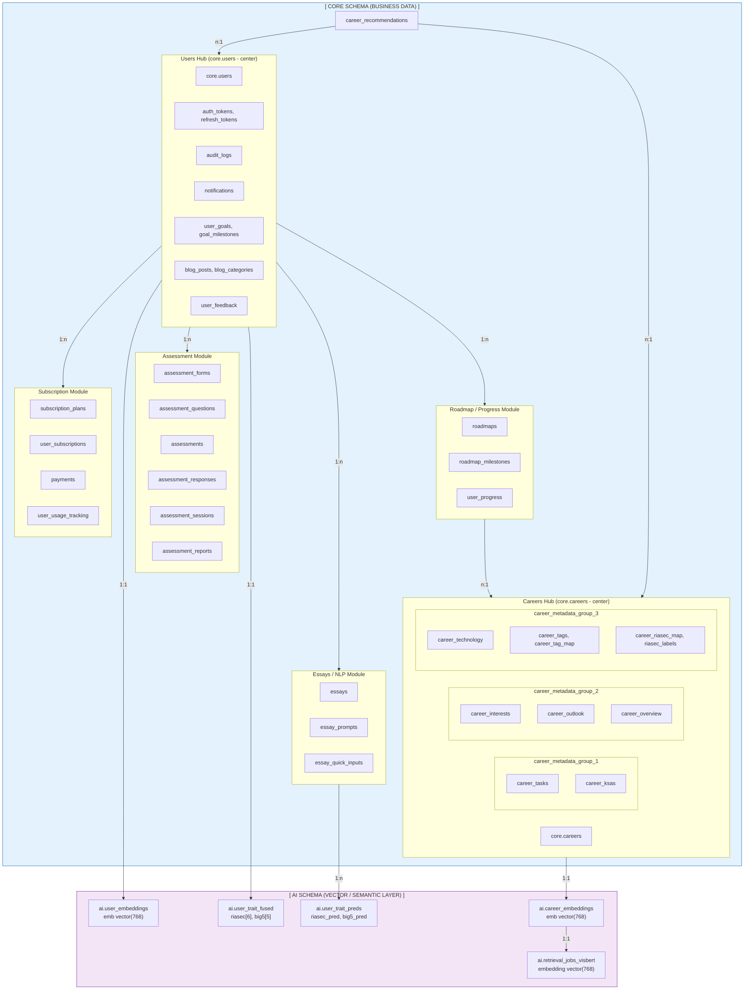

# Global ERD of the Core and AI Schemas

## Sơ đồ Tổng quan (High-Level Architecture)



## Sơ đồ Chi tiết ERD

```mermaid
erDiagram
    %% ==================== USERS HUB ====================
    core_users {
        bigint id PK
        text email UK
        text password_hash
        text full_name
        text avatar_url
        text role
        boolean is_locked
        boolean is_blocked
        boolean is_email_verified
        timestamp created_at
        timestamp last_login
        date date_of_birth
        text riasec_top_dim
        text big5_profile
    }
    
    core_auth_tokens {
        bigint id PK
        bigint user_id FK
        text token
        text ttype
        timestamp expires_at
        timestamp used_at
    }
    
    core_refresh_tokens {
        bigint id PK
        bigint user_id FK
        text token
        timestamp expires_at
        boolean revoked
    }
    
    core_audit_logs {
        int id PK
        int user_id FK
        varchar action
        varchar resource_type
        varchar resource_id
        jsonb details
        varchar ip_address
        text user_agent
    }
    
    core_notifications {
        bigint id PK
        bigint user_id FK
        text type
        text title
        text message
        text link
        boolean is_read
    }
    
    %% ==================== ASSESSMENT MODULE ====================
    core_assessment_forms {
        bigint id PK
        text code
        text title
        text form_type "RIASEC|BigFive|ESSAY"
        text lang
        text version
    }
    
    core_assessment_questions {
        bigint id PK
        bigint form_id FK
        int question_no
        text question_key
        text prompt
        jsonb options_json
        boolean reverse_score
    }
    
    core_assessment_sessions {
        bigint id PK
        bigint user_id FK
        timestamp created_at
    }
    
    core_assessments {
        bigint id PK
        bigint user_id FK
        bigint session_id FK
        text a_type "RIASEC|BigFive"
        jsonb scores
        jsonb processed_riasec_scores
        jsonb processed_big_five_scores
        text top_interest
        jsonb career_recommendations
        jsonb essay_analysis
    }
    
    core_assessment_responses {
        bigint id PK
        bigint assessment_id FK
        bigint question_id FK
        text question_key
        text answer_raw
        numeric score_value
    }
    
    core_assessment_reports {
        bigint id PK
        bigint user_id FK
        bigint session_id FK
        bigint assessment_id FK
        bigint template_id FK
        text report_type
        text locale
        text status
        jsonb cover_json
        jsonb narrative_json
        jsonb scores_json
        jsonb facets_json
    }
    
    %% ==================== ESSAY MODULE ====================
    core_essay_prompts {
        bigint id PK
        text title
        text prompt_text
        text lang
    }
    
    core_essays {
        bigint id PK
        bigint user_id FK
        bigint prompt_id FK
        text content
        text lang
    }
    
    core_essay_quick_inputs {
        bigint id PK
        bigint user_id FK
        bigint prompt_id FK
        uuid session_id
        text text
        text lang
        boolean used_for_profile
    }
    
    %% ==================== CAREERS HUB ====================
    core_careers {
        bigint id PK
        text slug UK
        text onet_code UK
        text title_en
        text title_vi
        text short_desc_en
        text short_desc_vn
        varchar source
        varchar industry_category
    }
    
    core_career_interests {
        text onet_code PK_FK
        numeric r
        numeric i
        numeric a
        numeric s
        numeric e
        numeric c
        text source
    }
    
    core_career_outlook {
        text onet_code PK_FK
        text summary_md
        text growth_label
        int openings_est
    }
    
    core_career_overview {
        bigint id PK
        bigint career_id FK
        text experience_text
        text degree_text
        numeric salary_min
        numeric salary_max
        numeric salary_avg
        jsonb salary_bands
    }
    
    core_career_tasks {
        bigint id PK
        text onet_code FK
        text task_text
        numeric importance
    }
    
    core_career_ksas {
        bigint id PK
        text onet_code FK
        text ksa_type
        text name
        text category
        numeric level
        numeric importance
    }
    
    core_career_technology {
        bigint id PK
        text onet_code FK
        text category
        text name
        boolean hot_flag
    }
    
    core_career_tags {
        bigint id PK
        text name UK
    }
    
    core_career_tag_map {
        bigint career_id PK_FK
        bigint tag_id PK_FK
    }
    
    core_riasec_labels {
        bigint id PK
        text code UK
    }
    
    core_career_riasec_map {
        bigint career_id PK_FK
        bigint label_id PK_FK
    }
    
    core_career_recommendations {
        int id PK
        int user_id FK
        int assessment_id FK
        int career_id FK
        numeric score
        int rank
    }
    
    %% ==================== ROADMAP MODULE ====================
    core_roadmaps {
        bigint id PK
        bigint career_id FK
        text title
        text title_en
        text title_vn
    }
    
    core_roadmap_milestones {
        bigint id PK
        bigint roadmap_id FK
        int order_no
        text skill_name
        text description
        text estimated_duration
        jsonb resources_json
        int level
    }
    
    core_user_progress {
        bigint id PK
        bigint user_id FK
        bigint career_id FK
        bigint roadmap_id FK
        bigint current_milestone_id FK
        jsonb completed_milestones
        jsonb milestone_completions
        numeric progress_percentage
    }
    
    core_user_goals {
        bigint id PK
        bigint user_id FK
        text goal_text
        varchar career_id
        varchar career_name
        varchar goal_type
        date target_date
        varchar status
        int priority
    }
    
    core_goal_milestones {
        bigint id PK
        bigint goal_id FK
        varchar title
        text description
        date target_date
        varchar status
        int order_index
    }
    
    core_user_feedback {
        bigint id PK
        bigint user_id FK
        bigint assessment_id FK
        int rating
        text comment
    }
    
    %% ==================== SUBSCRIPTION MODULE ====================
    core_subscription_plans {
        bigint id PK
        text name
        numeric price_monthly
        numeric price_yearly
        jsonb features
        jsonb limits
        boolean is_active
    }
    
    core_user_subscriptions {
        bigint id PK
        bigint user_id FK
        bigint plan_id FK
        varchar status
        timestamp start_date
        timestamp end_date
        timestamp expires_at
        text payment_method
        text payment_id
    }
    
    core_payments {
        bigint id PK
        bigint user_id FK
        varchar order_id UK
        varchar app_trans_id
        int amount
        text description
        varchar payment_method
        varchar status
        text order_url
    }
    
    core_user_usage_tracking {
        bigint id PK
        bigint user_id FK
        text feature_type
        int usage_count
        date last_reset_date
    }
    
    %% ==================== BLOG MODULE ====================
    core_blog_posts {
        bigint id PK
        bigint author_id FK
        text title
        text slug UK
        text content_md
        blog_status status
        timestamp published_at
        text excerpt
        text category
        jsonb tags
        text featured_image
        bigint view_count
        boolean is_featured
    }
    
    core_blog_categories {
        bigint id PK
        text name
        text slug UK
        text description
        text color
    }
    
    %% ==================== AI SCHEMA ====================
    ai_user_embeddings {
        bigint user_id PK_FK
        vector_768 emb
        text source "essay|profile"
        text model_name
        timestamp built_at
    }
    
    ai_user_trait_preds {
        bigint user_id PK_FK
        bigint essay_id PK_FK
        real_6 riasec_pred
        real_5 big5_pred
        text source
        text model_name
        timestamp built_at
    }
    
    ai_user_trait_fused {
        bigint user_id PK_FK
        real_6 riasec_scores_fused
        real_5 big5_scores_fused
        jsonb source_components
        text model_name
        timestamp built_at
    }
    
    ai_career_embeddings {
        bigint career_id PK_FK
        text job_id
        vector_768 emb
        text model_name
        timestamp built_at
    }
    
    ai_retrieval_jobs_visbert {
        bigint id PK
        text job_id UK
        text title
        text tags_vi
        text_arr tag_tokens
        real_6 riasec_centroid
        vector_768 embedding
    }
    
    %% ==================== RELATIONSHIPS ====================
    %% Users Hub
    core_users ||--o{ core_auth_tokens : "has"
    core_users ||--o{ core_refresh_tokens : "has"
    core_users ||--o{ core_audit_logs : "creates"
    core_users ||--o{ core_notifications : "receives"
    
    %% Assessment Module
    core_users ||--o{ core_assessment_sessions : "creates"
    core_assessment_sessions ||--o{ core_assessments : "contains"
    core_users ||--o{ core_assessments : "takes"
    core_assessment_forms ||--o{ core_assessment_questions : "has"
    core_assessments ||--o{ core_assessment_responses : "has"
    core_assessment_questions ||--o{ core_assessment_responses : "answered_by"
    core_assessments ||--o| core_assessment_reports : "generates"
    
    %% Essay Module
    core_users ||--o{ core_essays : "writes"
    core_essay_prompts ||--o{ core_essays : "used_by"
    core_users ||--o{ core_essay_quick_inputs : "creates"
    
    %% Careers Hub
    core_careers ||--o| core_career_interests : "has"
    core_careers ||--o| core_career_outlook : "has"
    core_careers ||--o| core_career_overview : "has"
    core_careers ||--o{ core_career_tasks : "has"
    core_careers ||--o{ core_career_ksas : "has"
    core_careers ||--o{ core_career_technology : "has"
    core_careers ||--o{ core_career_tag_map : "tagged_with"
    core_career_tags ||--o{ core_career_tag_map : "tags"
    core_careers ||--o{ core_career_riasec_map : "mapped_to"
    core_riasec_labels ||--o{ core_career_riasec_map : "labels"
    
    %% Recommendations
    core_users ||--o{ core_career_recommendations : "receives"
    core_assessments ||--o{ core_career_recommendations : "generates"
    core_careers ||--o{ core_career_recommendations : "recommended"
    
    %% Roadmap Module
    core_careers ||--o{ core_roadmaps : "has"
    core_roadmaps ||--o{ core_roadmap_milestones : "contains"
    core_users ||--o{ core_user_progress : "tracks"
    core_roadmaps ||--o{ core_user_progress : "tracked_in"
    core_users ||--o{ core_user_goals : "sets"
    core_user_goals ||--o{ core_goal_milestones : "has"
    core_users ||--o{ core_user_feedback : "gives"
    
    %% Subscription Module
    core_subscription_plans ||--o{ core_user_subscriptions : "subscribed"
    core_users ||--o{ core_user_subscriptions : "has"
    core_users ||--o{ core_payments : "makes"
    core_users ||--o{ core_user_usage_tracking : "tracked"
    
    %% Blog Module
    core_users ||--o{ core_blog_posts : "authors"
    
    %% AI Schema relationships
    core_users ||--o| ai_user_embeddings : "has_embedding"
    core_users ||--o| ai_user_trait_fused : "has_fused_traits"
    core_users ||--o{ ai_user_trait_preds : "has_predictions"
    core_essays ||--o{ ai_user_trait_preds : "analyzed_by"
    core_careers ||--o| ai_career_embeddings : "has_embedding"
    ai_career_embeddings ||--o| ai_retrieval_jobs_visbert : "indexed_in"
```


## Sơ đồ Text-Based (Style giống hình gốc)

```
┌─────────────────────────────────────────────────────────────────────────────────────────────────────────────────────────────────────────┐
│                                              GLOBAL ERD OF THE CORE AND AI SCHEMAS                                                       │
│                                                  (Cập nhật theo Code thực tế)                                                            │
└─────────────────────────────────────────────────────────────────────────────────────────────────────────────────────────────────────────┘

┌─────────────────────────────────────────────────────────────────────────────────────────┐    ┌─────────────────────────────────────────┐
│                              [ CORE SCHEMA (BUSINESS DATA) ]                             │    │   [ AI SCHEMA (VECTOR/SEMANTIC LAYER) ] │
└─────────────────────────────────────────────────────────────────────────────────────────┘    └─────────────────────────────────────────┘

                    ┌─────────────────────────────────────────────────────────────────┐
                    │                    Users Hub (core.users - center)               │
                    │  Includes: auth_tokens, refresh_tokens, audit_logs, notifications│                    ┌─────────────────────────┐
                    │           user_goals, goal_milestones, blog_posts, user_feedback │────────1:1─────────│   ai.user_embeddings    │
                    └─────────────────────────────────────────────────────────────────┘                    │   emb vector(768)       │
                              │              │              │              │                                │   source, model_name    │
                              │1             │1             │1             │1                               └─────────────────────────┘
                              │              │              │              │                                            │
                              ▼n             ▼n             ▼n             ▼n                                           │1
        ┌─────────────────────────┐  ┌─────────────────┐  ┌─────────────────────────┐  ┌─────────────────────────┐      │
        │   Assessment Module     │  │ Essays/NLP      │  │ Subscription Module     │  │ Blog Module             │      ▼
        │ (forms, questions,      │  │ Module          │  │ (subscription_plans,    │  │ (blog_posts,            │ ┌─────────────────────────┐
        │  assessments, responses,│  │ (essays,        │  │  user_subscriptions,    │  │  blog_categories)       │ │   ai.user_trait_fused   │
        │  sessions, reports)     │  │  essay_prompts, │  │  payments,              │  │                         │ │   riasec_scores_fused   │
        └─────────────────────────┘  │  quick_inputs)  │  │  user_usage_tracking)   │  │                         │ │   big5_scores_fused     │
                    │                └─────────────────┘  └─────────────────────────┘  └─────────────────────────┘ │   source_components     │
                    │                         │                                                                     └─────────────────────────┘
                    │n                        │1
                    │                         │                                                                     ┌─────────────────────────┐
                    ▼                         ▼n                                                                    │   ai.user_trait_preds   │
        ┌─────────────────────────────────────────────────────────────────┐                                        │   user_id, essay_id     │
        │              Roadmap / Progress Module                           │                                        │   riasec_pred real[6]   │
        │  (roadmaps, roadmap_milestones, user_progress, user_feedback)   │◄───────────────────────────────────────│   big5_pred real[5]     │
        └─────────────────────────────────────────────────────────────────┘                                        │   model_name            │
                              │                                                                                     └─────────────────────────┘
                              │1
                              │
                              ▼n
        ┌─────────────────────────────────────────────────────────────────┐                    ┌─────────────────────────┐
        │                  Careers Hub (core.careers - center)             │────────1:1────────│  ai.career_embeddings   │
        │  Includes all core.career_* metadata tables:                     │                    │  career_id, job_id      │
        │  (interests, outlook, overview, tags, riasec_map, sources, ...)  │                    │  emb vector(768)        │
        └─────────────────────────────────────────────────────────────────┘                    │  model_name             │
                    │              │              │                                             └─────────────────────────┘
                    │1             │1             │1                                                        │
                    │              │              │                                                         │1
                    ▼n             ▼n             ▼n                                                        │
        ┌─────────────────┐ ┌─────────────────┐ ┌─────────────────┐                                         ▼n
        │career_metadata  │ │career_metadata  │ │career_metadata  │                            ┌─────────────────────────┐
        │   _group_1      │ │   _group_2      │ │   _group_3      │                            │ai.retrieval_jobs_visbert│
        │ (tasks, ksas)   │ │ (interests,     │ │ (technology,    │                            │   job_id (O*NET code)   │
        │                 │ │  outlook,       │ │  tags, riasec)  │                            │   title, tags_vi        │
        │                 │ │  overview)      │ │                 │                            │   tag_tokens text[]     │
        └─────────────────┘ └─────────────────┘ └─────────────────┘                            │   riasec_centroid[6]    │
                                                                                               │   embedding vector(768) │
                                                                                               └─────────────────────────┘
```

## Danh sách Đầy đủ Các Bảng

### Schema `core` - Business Data (40+ tables)

| Module | Tables |
|--------|--------|
| **Users Hub** | `users`, `auth_tokens`, `refresh_tokens`, `audit_logs`, `notifications`, `admin_notifications` |
| **Assessment** | `assessment_forms`, `assessment_questions`, `assessment_sessions`, `assessments`, `assessment_responses`, `assessment_reports`, `report_templates` |
| **Essays** | `essays`, `essay_prompts`, `essay_quick_inputs` |
| **Careers** | `careers`, `career_interests`, `career_outlook`, `career_overview`, `career_tasks`, `career_ksas`, `career_technology`, `career_tags`, `career_tag_map`, `career_riasec_map`, `riasec_labels`, `career_sources`, `career_recommendations` |
| **Roadmap** | `roadmaps`, `roadmap_milestones`, `user_progress`, `user_goals`, `goal_milestones`, `user_feedback` |
| **Subscription** | `subscription_plans`, `user_subscriptions`, `payments`, `user_usage_tracking`, `user_test_quota` |
| **Blog** | `blog_posts`, `blog_categories` |
| **System** | `app_settings`, `system_config`, `sync_jobs`, `anomalies` |

### Schema `ai` - Vector/Semantic Layer (6 tables)

| Table | Description | Vector |
|-------|-------------|--------|
| `user_embeddings` | User essay embeddings | `emb vector(768)` |
| `user_trait_preds` | PhoBERT predictions per essay | `riasec_pred real[6]`, `big5_pred real[5]` |
| `user_trait_fused` | Fused traits (test + essay) | `riasec_scores_fused real[6]`, `big5_scores_fused real[5]` |
| `career_embeddings` | Career embeddings | `emb vector(768)` |
| `retrieval_jobs_visbert` | Job index for pgvector search | `embedding vector(768)` |
| `quick_text_embeddings` | Temporary embeddings | `emb vector(768)` |

### Schema `analytics` - Event Tracking (3 tables)

| Table | Description |
|-------|-------------|
| `career_events` | User interactions with careers (impression, click, save, apply) |
| `report_events` | Report viewing events |
| `report_pages` | Report page definitions |

### Schema `chatbot` - Chatbot (2 tables)

| Table | Description |
|-------|-------------|
| `chat_sessions` | Chat session management |
| `chat_messages` | Chat message history |

## Relationships Summary

### Core → AI Relationships

```
core.users ──────1:1──────► ai.user_embeddings
core.users ──────1:1──────► ai.user_trait_fused  
core.users ──────1:n──────► ai.user_trait_preds
core.essays ─────1:n──────► ai.user_trait_preds

core.careers ────1:1──────► ai.career_embeddings
ai.career_embeddings ─1:1─► ai.retrieval_jobs_visbert
```

### Key Foreign Keys

| From Table | To Table | FK Column |
|------------|----------|-----------|
| `ai.user_embeddings` | `core.users` | `user_id` |
| `ai.user_trait_preds` | `core.users` | `user_id` |
| `ai.user_trait_preds` | `core.essays` | `essay_id` |
| `ai.user_trait_fused` | `core.users` | `user_id` |
| `ai.career_embeddings` | `core.careers` | `career_id` |
| `ai.retrieval_jobs_visbert` | `core.careers` | `job_id` (via onet_code) |

## So sánh với Sơ đồ Gốc

| Component | Sơ đồ Gốc | Thực tế | Ghi chú |
|-----------|-----------|---------|---------|
| Users Hub | ✅ | ✅ | Đầy đủ các bảng auth, audit, notifications |
| Assessment Module | ✅ | ✅ | Thêm `assessment_reports`, `report_templates` |
| Essays/NLP Module | ✅ | ✅ | Thêm `essay_quick_inputs` |
| Roadmap/Progress | ✅ | ✅ | Thêm `user_goals`, `goal_milestones` |
| Careers Hub | ✅ | ✅ | Đầy đủ metadata tables |
| career_metadata_group_1 | tasks, dwas, ksas | tasks, ksas | Không có `dwas` |
| career_metadata_group_2 | work_context, work_activities | interests, outlook, overview | Khác tên |
| career_metadata_group_3 | wages, education, prep | technology, tags, riasec | Khác tên |
| ai.user_embeddings | ✅ | ✅ | `emb vector(768)` |
| ai.user_trait_fused | ✅ | ✅ | `riasec_scores_fused`, `big5_scores_fused` |
| ai.career_embeddings | ✅ | ✅ | `emb vector(768)` |
| ai.retrieval_jobs_visbert | ✅ | ✅ | `embedding vector(768)` |
| **Thêm mới** | - | `ai.user_trait_preds` | PhoBERT predictions per essay |
| **Thêm mới** | - | `ai.quick_text_embeddings` | Temporary embeddings |
| **Thêm mới** | - | Subscription Module | `subscription_plans`, `payments`, etc. |
| **Thêm mới** | - | Blog Module | `blog_posts`, `blog_categories` |
| **Thêm mới** | - | Analytics Schema | `career_events`, `report_events` |
| **Thêm mới** | - | Chatbot Schema | `chat_sessions`, `chat_messages` |
