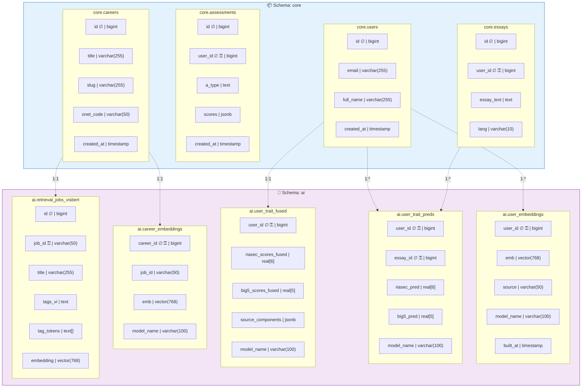
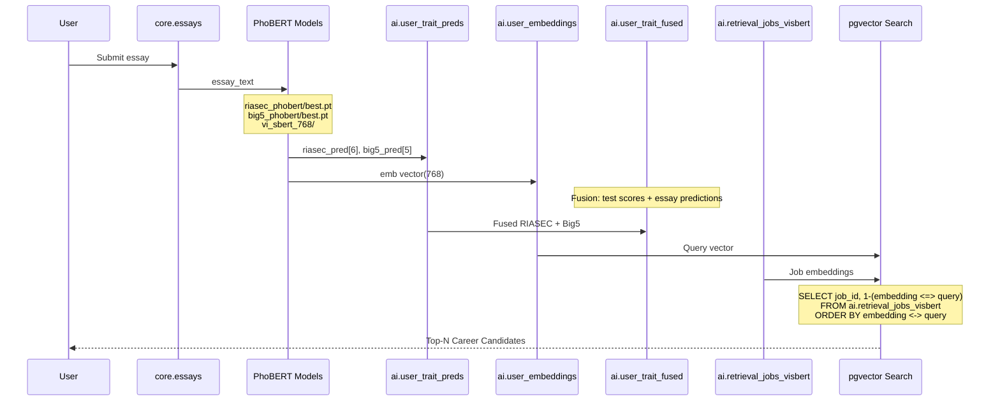

# 2.4 Semantic Vector Layer Architecture (Cập nhật theo Code thực tế)

## Sơ đồ ERD - Database Schema

```mermaid
erDiagram
    %% ==================== SCHEMA: core ====================
    core_users {
        bigint id PK
        text email UK
        text full_name
        text password_hash
        boolean is_verified
        boolean is_admin
        timestamp created_at
    }

    core_careers {
        bigint id PK
        text slug UK
        text onet_code UK
        text title
        text title_vi
        text description
        text description_vi
        text salary_range
        text education_level
        text job_zone
        boolean is_active
        timestamp created_at
    }

    core_assessments {
        bigint id PK
        bigint user_id FK
        bigint session_id FK
        text a_type "RIASEC | BigFive"
        jsonb scores
        jsonb processed_riasec_scores
        jsonb processed_big_five_scores
        text top_interest
        jsonb career_recommendations
        jsonb essay_analysis
        timestamp created_at
    }

    core_essays {
        bigint id PK
        bigint user_id FK
        bigint session_id FK
        text essay_text
        text lang
        timestamp created_at
    }

    core_career_recommendations {
        int id PK
        int user_id FK
        int assessment_id FK
        text career_id
        float match_score
        int rank_position
        text source
        timestamp created_at
    }

    %% ==================== SCHEMA: ai ====================
    ai_user_embeddings {
        bigint user_id PK_FK
        vector_768 emb "vector(768)"
        text source "essay | profile"
        text model_name "vi-sbert"
        timestamp built_at
    }

    ai_user_trait_preds {
        bigint user_id PK_FK
        bigint essay_id PK_FK
        real_array riasec_pred "real[6]"
        real_array big5_pred "real[5]"
        text source "essay"
        text model_name "phobert"
        timestamp built_at
    }

    ai_user_trait_fused {
        bigint user_id PK_FK
        real_array riasec_scores_fused "real[6]"
        real_array big5_scores_fused "real[5]"
        jsonb source_components
        text model_name "fusion_v1"
        timestamp built_at
    }

    ai_career_embeddings {
        bigint career_id PK_FK
        text job_id
        vector_768 emb "vector(768)"
        text model_name "vi-sbert"
        timestamp built_at
    }

    ai_retrieval_jobs_visbert {
        bigint id PK
        text job_id UK
        text title
        text tags_vi
        text_array tag_tokens "text[]"
        real_array riasec_centroid "real[6]"
        vector_768 embedding "vector(768)"
        timestamp created_at
    }

    %% ==================== RELATIONSHIPS ====================
    core_users ||--o{ core_assessments : "has"
    core_users ||--o{ core_essays : "writes"
    core_users ||--o{ core_career_recommendations : "receives"
    core_users ||--o| ai_user_embeddings : "has embedding"
    core_users ||--o{ ai_user_trait_preds : "has predictions"
    core_users ||--o| ai_user_trait_fused : "has fused traits"
    
    core_careers ||--o| ai_career_embeddings : "has embedding"
    core_careers }|--|| ai_retrieval_jobs_visbert : "indexed in"
    
    core_assessments ||--o{ core_career_recommendations : "generates"
    core_essays ||--o{ ai_user_trait_preds : "analyzed by"
```

## Sơ đồ Chi tiết theo Style Gốc



## Bảng So sánh: Sơ đồ Gốc vs Code Thực tế

| Bảng trong Sơ đồ Gốc | Tồn tại? | Tên thực tế | Ghi chú |
|---------------------|----------|-------------|---------|
| `core_users` | ✅ | `core.users` | Đúng |
| `core_careers` | ✅ | `core.careers` | Đúng |
| `ai_user_embeddings` | ✅ | `ai.user_embeddings` | Đúng - có `emb vector(768)` |
| `ai_user_trait_fused` | ✅ | `ai.user_trait_fused` | Đúng - có `riasec_scores_fused`, `big5_scores_fused` |
| `ai_career_embeddings` | ✅ | `ai.career_embeddings` | Đúng - có `emb vector(768)` |
| `ai_retrieval_jobs_visbert` | ✅ | `ai.retrieval_jobs_visbert` | Đúng - có `embedding vector(768)` |

## Chi tiết Schema Thực tế

### Schema `ai` - AI/ML Tables

```sql
-- 1. ai.user_embeddings - User essay embeddings
CREATE TABLE ai.user_embeddings (
    user_id bigint NOT NULL,           -- PK, FK -> core.users
    emb public.vector(768) NOT NULL,   -- vi-SBERT embedding
    source text DEFAULT 'essay',       -- 'essay' | 'profile'
    model_name text DEFAULT 'vi-sbert',
    built_at timestamp with time zone DEFAULT now()
);

-- 2. ai.user_trait_preds - PhoBERT predictions per essay
CREATE TABLE ai.user_trait_preds (
    user_id bigint NOT NULL,           -- FK -> core.users
    essay_id bigint NOT NULL,          -- FK -> core.essays
    riasec_pred real[] NOT NULL,       -- [R,I,A,S,E,C] 6 floats
    big5_pred real[] NOT NULL,         -- [O,C,E,A,N] 5 floats
    source text DEFAULT 'essay',
    model_name text DEFAULT 'phobert',
    built_at timestamp with time zone DEFAULT now()
);

-- 3. ai.user_trait_fused - Fused traits (test + essay)
CREATE TABLE ai.user_trait_fused (
    user_id bigint NOT NULL,                    -- PK, FK -> core.users
    riasec_scores_fused real[] NOT NULL,        -- [R,I,A,S,E,C] normalized 0-1
    big5_scores_fused real[] NOT NULL,          -- [O,C,E,A,N] normalized 0-1
    source_components jsonb DEFAULT '["test", "essay"]',
    model_name text DEFAULT 'fusion_v1',
    built_at timestamp with time zone DEFAULT now()
);

-- 4. ai.career_embeddings - Career embeddings
CREATE TABLE ai.career_embeddings (
    career_id bigint NOT NULL,         -- PK, FK -> core.careers
    emb public.vector(768) NOT NULL,   -- vi-SBERT embedding
    model_name text DEFAULT 'vi-sbert',
    built_at timestamp with time zone DEFAULT now(),
    job_id text                        -- O*NET code
);

-- 5. ai.retrieval_jobs_visbert - Job index for pgvector search
CREATE TABLE ai.retrieval_jobs_visbert (
    id bigint NOT NULL,                        -- PK
    job_id text NOT NULL,                      -- O*NET code (unique)
    title text,
    tags_vi text,
    tag_tokens text[] DEFAULT '{}',            -- RIASEC tags for filtering
    riasec_centroid real[],                    -- [R,I,A,S,E,C] centroid
    embedding public.vector(768) NOT NULL,     -- vi-SBERT embedding
    created_at timestamp with time zone DEFAULT now()
);
```

### Schema `core` - Core Business Tables

```sql
-- core.users
CREATE TABLE core.users (
    id bigint PRIMARY KEY,
    email text UNIQUE NOT NULL,
    full_name text,
    password_hash text,
    is_verified boolean DEFAULT false,
    is_admin boolean DEFAULT false,
    created_at timestamp with time zone DEFAULT now()
);

-- core.careers
CREATE TABLE core.careers (
    id bigint PRIMARY KEY,
    slug text UNIQUE NOT NULL,
    onet_code text UNIQUE,
    title text,
    title_vi text,
    description text,
    description_vi text,
    salary_range text,
    education_level text,
    job_zone text,
    is_active boolean DEFAULT true,
    created_at timestamp with time zone DEFAULT now()
);

-- core.assessments
CREATE TABLE core.assessments (
    id bigint PRIMARY KEY,
    user_id bigint NOT NULL REFERENCES core.users(id),
    session_id bigint,
    a_type text NOT NULL,              -- 'RIASEC' | 'BigFive'
    scores jsonb NOT NULL,
    processed_riasec_scores jsonb,     -- AI-processed scores
    processed_big_five_scores jsonb,
    top_interest text,                 -- Top RIASEC letter
    career_recommendations jsonb,
    essay_analysis jsonb,
    created_at timestamp with time zone DEFAULT now()
);

-- core.essays
CREATE TABLE core.essays (
    id bigint PRIMARY KEY,
    user_id bigint NOT NULL REFERENCES core.users(id),
    session_id bigint,
    essay_text text NOT NULL,
    lang text DEFAULT 'vi',
    created_at timestamp with time zone DEFAULT now()
);
```

## Data Flow trong Semantic Vector Layer



## Indexes cho pgvector

```sql
-- IVFFlat index cho approximate nearest neighbor search
CREATE INDEX idx_retrieval_jobs_embedding 
ON ai.retrieval_jobs_visbert 
USING ivfflat (embedding vector_cosine_ops) 
WITH (lists = 100);

-- Index cho user embeddings
CREATE INDEX idx_user_embeddings_user_id 
ON ai.user_embeddings(user_id);

-- Index cho career embeddings
CREATE INDEX idx_career_embeddings_career_id 
ON ai.career_embeddings(career_id);
```

## Kết luận

Sơ đồ gốc **khá chính xác** với code thực tế. Các điểm chính:

1. ✅ **Tất cả các bảng trong sơ đồ gốc đều tồn tại** trong database
2. ✅ **Vector dimension = 768** (vi-SBERT)
3. ✅ **pgvector extension** được sử dụng cho similarity search
4. ⚠️ **Thêm bảng `ai.user_trait_preds`** - lưu predictions từ PhoBERT per essay
5. ⚠️ **Thêm bảng `ai.quick_text_embeddings`** - cho retrieval/essay embeddings tạm thời


---

## Sơ đồ Text-Based (Style giống hình gốc)

```
┌─────────────────────────────────────────────────────────────────────────────────────────────────────────────────────┐
│                                    2.4 Semantic Vector Layer Architecture                                            │
│                                         (Cập nhật theo Code thực tế)                                                 │
└─────────────────────────────────────────────────────────────────────────────────────────────────────────────────────┘

┌─────────────────────────┐      ┌─────────────────────────┐      ┌─────────────────────────┐      ┌─────────────────────────┐
│      core.users         │      │     core.careers        │      │   ai.user_embeddings    │      │   ai.user_trait_fused   │
├─────────────────────────┤      ├─────────────────────────┤      ├─────────────────────────┤      ├─────────────────────────┤
│ id ∅           bigint   │──1───│ id ∅           bigint   │      │ user_id ∅ ⚿    bigint   │──────│ user_id ∅ ⚿    bigint   │
│                         │      │                         │      │                         │      │                         │
│ email      varchar(255) │      │ title      varchar(255) │      │ emb        vector(768)  │      │ riasec_scores_fused     │
│                         │      │                         │      │                         │      │              real[6]    │
│ full_name  varchar(255) │      │ slug       varchar(255) │      │ source      varchar(50) │      │                         │
│                         │      │                         │      │                         │      │ big5_scores_fused       │
│ created_at   timestamp  │      │ onet_code   varchar(50) │      │ model_name varchar(100) │      │              real[5]    │
│                         │      │                         │      │                         │      │                         │
│                         │      │ created_at   timestamp  │      │ built_at     timestamp  │      │ source_components jsonb │
│                         │      │                         │      │                         │      │                         │
│                         │      │                         │      │                         │      │ model_name varchar(100) │
│                         │      │                         │      │                         │      │                         │
│                         │      │                         │      │                         │      │ built_at     timestamp  │
└─────────────────────────┘      └─────────────────────────┘      └─────────────────────────┘      └─────────────────────────┘
         │                                │                                │                                │
         │ 1                              │ 1                              │ *                              │ 1
         │                                │                                │                                │
         ▼ *                              ▼ 1                              ▼                                ▼
┌─────────────────────────┐      ┌─────────────────────────┐      ┌─────────────────────────┐      ┌─────────────────────────┐
│  ai.career_embeddings   │      │ai.retrieval_jobs_visbert│      │   ai.user_trait_preds   │      │      core.essays        │
├─────────────────────────┤      ├─────────────────────────┤      ├─────────────────────────┤      ├─────────────────────────┤
│ career_id ∅ ⚿  bigint   │      │ id ∅           bigint   │      │ user_id ∅ ⚿    bigint   │      │ id ∅           bigint   │
│                         │      │                         │      │                         │      │                         │
│ job_id      varchar(50) │  0..1│ job_id ⚿    varchar(50) │      │ essay_id ∅ ⚿   bigint   │      │ user_id ⚿      bigint   │
│                         │──────│                         │      │                         │      │                         │
│ emb        vector(768)  │      │ title      varchar(255) │      │ riasec_pred    real[6]  │      │ essay_text       text   │
│                         │      │                         │      │                         │      │                         │
│ model_name varchar(100) │      │ tags_vi          text   │      │ big5_pred      real[5]  │      │ lang        varchar(10) │
│                         │      │                         │      │                         │      │                         │
│ built_at     timestamp  │      │ tag_tokens     text[]   │      │ source      varchar(50) │      │ session_id      bigint  │
│                         │      │                         │      │                         │      │                         │
│                         │      │ riasec_centroid real[6] │      │ model_name varchar(100) │      │ created_at   timestamp  │
│                         │      │                         │      │                         │      │                         │
│                         │      │ embedding  vector(768)  │      │ built_at     timestamp  │      │                         │
│                         │      │                         │      │                         │      │                         │
│                         │      │ created_at   timestamp  │      │                         │      │                         │
└─────────────────────────┘      └─────────────────────────┘      └─────────────────────────┘      └─────────────────────────┘

Legend:
  ∅  = Primary Key
  ⚿  = Foreign Key
  1  = One
  *  = Many
  0..1 = Zero or One
```

## Mô tả Chi tiết Các Bảng

### 1. `ai.user_embeddings` - User Essay Embeddings
| Column | Type | Description |
|--------|------|-------------|
| `user_id` | bigint | PK, FK → core.users |
| `emb` | vector(768) | vi-SBERT embedding của essay |
| `source` | text | 'essay' hoặc 'profile' |
| `model_name` | text | 'vi-sbert' |
| `built_at` | timestamp | Thời điểm tạo |

### 2. `ai.user_trait_preds` - PhoBERT Predictions
| Column | Type | Description |
|--------|------|-------------|
| `user_id` | bigint | FK → core.users |
| `essay_id` | bigint | FK → core.essays |
| `riasec_pred` | real[6] | [R,I,A,S,E,C] predictions |
| `big5_pred` | real[5] | [O,C,E,A,N] predictions |
| `model_name` | text | 'phobert' |

### 3. `ai.user_trait_fused` - Fused Traits
| Column | Type | Description |
|--------|------|-------------|
| `user_id` | bigint | PK, FK → core.users |
| `riasec_scores_fused` | real[6] | Fused RIASEC (test + essay) |
| `big5_scores_fused` | real[5] | Fused Big5 (test + essay) |
| `source_components` | jsonb | ["test", "essay"] |

### 4. `ai.career_embeddings` - Career Embeddings
| Column | Type | Description |
|--------|------|-------------|
| `career_id` | bigint | PK, FK → core.careers |
| `job_id` | text | O*NET code |
| `emb` | vector(768) | vi-SBERT embedding |
| `model_name` | text | 'vi-sbert' |

### 5. `ai.retrieval_jobs_visbert` - Job Index (pgvector)
| Column | Type | Description |
|--------|------|-------------|
| `id` | bigint | PK |
| `job_id` | text | O*NET code (unique) |
| `title` | text | Job title |
| `tags_vi` | text | Vietnamese tags |
| `tag_tokens` | text[] | RIASEC tags for filtering |
| `riasec_centroid` | real[6] | RIASEC centroid |
| `embedding` | vector(768) | vi-SBERT embedding |

## pgvector Query Pattern

```sql
-- Semantic search với pgvector
SELECT 
    job_id,
    title,
    1 - (embedding <=> $1::vector(768)) AS score_sim
FROM ai.retrieval_jobs_visbert
ORDER BY embedding <-> $1::vector(768)
LIMIT 200;
```

Trong đó:
- `<=>` = Cosine distance (dùng cho score)
- `<->` = L2 distance (dùng cho ORDER BY với IVFFlat index)
- `$1` = User embedding vector từ `ai.user_embeddings`
