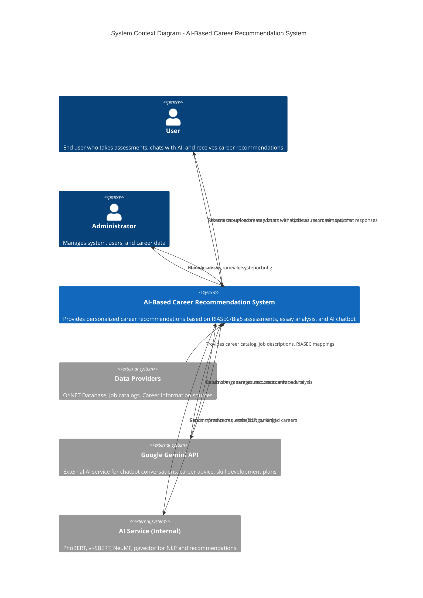
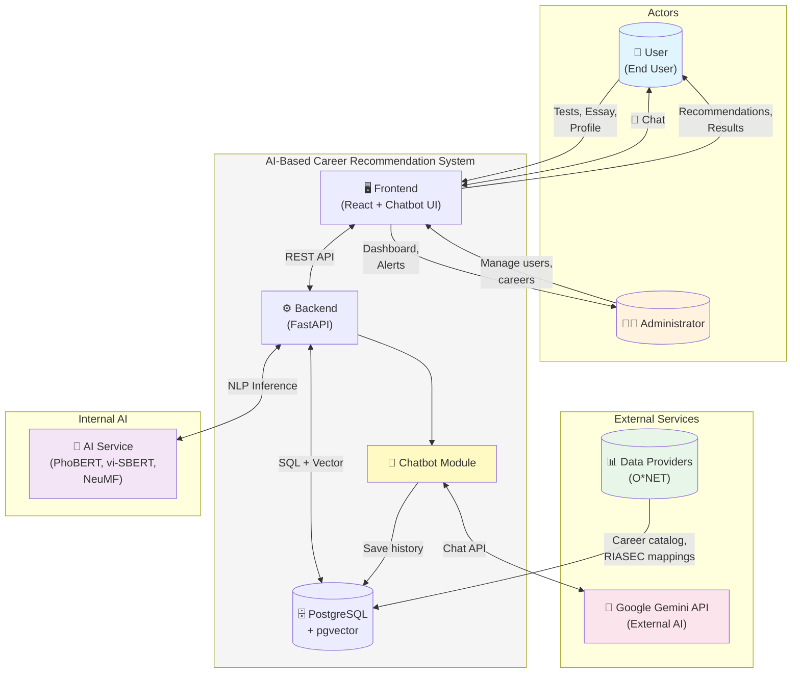

# System Context Diagram - AI-Based Career Recommendation System

## Sơ đồ Tổng quan (Cập nhật theo Code thực tế)

```
┌─────────────────────────────────────────────────────────────────────────────────────────────────────────────────────────────────────────┐
│                                                    SYSTEM CONTEXT DIAGRAM                                                                │
│                                            AI-Based Career Recommendation System                                                         │
└─────────────────────────────────────────────────────────────────────────────────────────────────────────────────────────────────────────┘


                                                                                    ┌─────────────────────────────────┐
                                                                                    │      Data Providers             │
                                                                                    │   (O*NET, Job Databases)        │
                                                                                    └─────────────────────────────────┘
                                                                                                    │
                                                                                                    │ • Career catalog sync
                                                                                                    │ • Job descriptions
                                                                                                    │ • RIASEC mappings
                                                                                                    │ • Skill requirements
                                                                                                    ▼
    ┌─────────────────────────────────┐                                             ┌─────────────────────────────────┐                     ┌─────────────────────────────────┐
    │                                 │     • Receive career recommendations        │                                 │                     │      External AI Service        │
    │                                 │     • View skill roadmap                    │                                 │                     │      (Google Gemini API)        │
    │                                 │◄────────────────────────────────────────────│                                 │                     └─────────────────────────────────┘
    │                                 │                                             │                                 │                                     ▲
    │                                 │     • Receive analysis results, scores      │                                 │                                     │
    │           User                  │◄────────────────────────────────────────────│                                 │                                     │ • Chat request
    │      (End User)                 │                                             │                                 │                                     │ • Career advice
    │                                 │     • Chat with AI Chatbot                  │                                 │─────────────────────────────────────┤ • Skill development
    │                                 │◄───────────────────────────────────────────►│                                 │                                     │ • Job market analysis
    │                                 │                                             │                                 │                                     │
    │                                 │     • Feedback loop: rate relevance         │                                 │                                     │ • AI response
    │                                 │────────────────────────────────────────────►│                                 │◄────────────────────────────────────┘
    │                                 │                                             │                                 │
    │                                 │     • Do RIASEC / Big Five tests            │      AI-Based Career            │
    │                                 │────────────────────────────────────────────►│      Recommendation             │
    │                                 │                                             │         System                  │
    │                                 │     • Submit profile, interests, goals      │                                 │
    │                                 │────────────────────────────────────────────►│                                 │
    │                                 │                                             │                                 │
    │                                 │     • Upload essay for NLP                  │                                 │
    │                                 │────────────────────────────────────────────►│                                 │
    └─────────────────────────────────┘                                             │                                 │
                                                                                    │                                 │
                                                                                    │                                 │
    ┌─────────────────────────────────┐                                             │                                 │
    │                                 │     • Manage jobs, skills, standards        │                                 │
    │                                 │────────────────────────────────────────────►│                                 │
    │                                 │                                             │                                 │
    │                                 │     • Manage accounts, roles                │                                 │
    │       Administrator             │────────────────────────────────────────────►│                                 │
    │                                 │                                             │                                 │
    │                                 │     • Access dashboard (users, stats)       │                                 │
    │                                 │◄────────────────────────────────────────────│                                 │
    │                                 │                                             │                                 │
    │                                 │     • Get alerts (errors, anomalies)        │                                 │
    │                                 │◄────────────────────────────────────────────│                                 │
    │                                 │                                             │                                 │
    │                                 │     • Data I/O (CSV/JSON import/export)     │                                 │
    │                                 │◄───────────────────────────────────────────►│                                 │
    └─────────────────────────────────┘                                             │                                 │
                                                                                    │                                 │
                                                                                    └─────────────────────────────────┘
                                                                                                    │
                                                                                                    │
                                                                                                    │ AI inference request
                                                                                                    │ (essay NLP, RIASEC +
                                                                                                    │  Big Five fusion,
                                                                                                    │  career ranking)
                                                                                                    ▼
                                                                                    ┌─────────────────────────────────┐
                                                                                    │      AI Service                 │
                                                                                    │   (Internal Microservice)       │
                                                                                    │                                 │
                                                                                    │   • PhoBERT (RIASEC/Big5)       │
                                                                                    │   • vi-SBERT (Embeddings)       │
                                                                                    │   • NeuMF (Ranking)             │
                                                                                    │   • pgvector (Retrieval)        │
                                                                                    └─────────────────────────────────┘


    ┌─────────────┐     ─────────►     ┌─────────────┐
    │   System    │                    │    Actor    │
    └─────────────┘    Interaction     └─────────────┘
```

---

## Mermaid Diagram



---

## Chi tiết Actors và Interactions

### 1. User (End User)

| Interaction | Direction | Mô tả |
|-------------|-----------|-------|
| Do RIASEC/Big Five tests | User → System | Làm bài test tâm lý nghề nghiệp |
| Upload essay for NLP | User → System | Gửi bài essay để AI phân tích |
| Submit profile, interests, goals | User → System | Cập nhật thông tin cá nhân, mục tiêu nghề nghiệp |
| **Chat with AI Chatbot** | User ↔ System | **Trò chuyện với chatbot AI để được tư vấn** |
| Feedback loop: rate relevance | User → System | Đánh giá độ phù hợp của recommendations |
| Receive career recommendations | System → User | Nhận danh sách nghề nghiệp phù hợp |
| Receive analysis results, scores | System → User | Nhận kết quả RIASEC/Big5, spider chart |
| View skill roadmap | System → User | Xem lộ trình phát triển kỹ năng |

### 2. Administrator

| Interaction | Direction | Mô tả |
|-------------|-----------|-------|
| Manage jobs, skills, standards | Admin → System | CRUD nghề nghiệp, kỹ năng, tiêu chuẩn |
| Manage accounts, roles | Admin → System | Quản lý user accounts, phân quyền |
| Access dashboard | System → Admin | Xem thống kê users, tests, API usage |
| Get alerts | System → Admin | Nhận cảnh báo lỗi, anomalies |
| Data I/O (CSV/JSON) | Bidirectional | Import/export dữ liệu careers, users |

### 3. Data Providers (thay cho "External Systems")

| Interaction | Direction | Mô tả |
|-------------|-----------|-------|
| Career catalog sync | Provider → System | Đồng bộ danh mục nghề nghiệp từ O*NET |
| Job descriptions | Provider → System | Mô tả công việc, yêu cầu |
| RIASEC mappings | Provider → System | Mapping nghề nghiệp với RIASEC codes |
| Skill requirements | Provider → System | Yêu cầu kỹ năng cho từng nghề |

**Lý do đổi tên "External Systems" → "Data Providers":**
- Rõ ràng hơn về vai trò: cung cấp dữ liệu nghề nghiệp
- Phân biệt với AI Service (internal) và Gemini API (external)
- Phù hợp với thực tế: O*NET, Job databases là nguồn dữ liệu

### 4. Google Gemini API (External AI Service) ⭐ NEW

| Interaction | Direction | Mô tả |
|-------------|-----------|-------|
| Chat request | System → Gemini | Gửi tin nhắn chat từ user |
| Career advice request | System → Gemini | Yêu cầu tư vấn nghề nghiệp dựa trên profile |
| Skill development plan | System → Gemini | Yêu cầu kế hoạch phát triển kỹ năng |
| Job market analysis | System → Gemini | Yêu cầu phân tích thị trường việc làm |
| AI response | Gemini → System | Trả về câu trả lời AI-generated |

**Chi tiết kỹ thuật:**
- **API**: Google Generative AI (`google-generativeai` package)
- **Models**: gemini-2.5-flash, gemini-pro, gemma-3-4b-it (fallback)
- **Endpoints**:
  - `POST /api/chatbot/chat` - Chat tự do
  - `POST /api/chatbot/career-advice` - Tư vấn nghề nghiệp
  - `POST /api/chatbot/skill-development` - Kế hoạch kỹ năng
  - `POST /api/chatbot/job-market-analysis` - Phân tích thị trường
- **Database**: `chatbot.chat_sessions`, `chatbot.chat_messages` (lưu lịch sử)

### 5. AI Service (Internal Microservice)

| Interaction | Direction | Mô tả |
|-------------|-----------|-------|
| AI inference request | System → AI | Gửi essay text, user features |
| RIASEC/Big5 predictions | AI → System | Trả về 6+5 scores từ PhoBERT |
| Essay embeddings | AI → System | Trả về vector 768D từ vi-SBERT |
| Career ranking | AI → System | Trả về ranked careers từ NeuMF |
| Semantic search | AI → System | Trả về candidates từ pgvector |

---

## Sơ đồ Cập nhật với Gemini Chatbot



---

## Chatbot Architecture Detail

```
┌─────────────────────────────────────────────────────────────────────────────────────────┐
│                              CHATBOT ARCHITECTURE                                        │
└─────────────────────────────────────────────────────────────────────────────────────────┘

    ┌─────────────┐         ┌─────────────────────────────────────────────────────────┐
    │             │         │                    BACKEND                               │
    │   User      │         │  ┌─────────────────────────────────────────────────┐   │
    │  (Browser)  │         │  │              Chatbot Module                      │   │
    │             │         │  │                                                  │   │
    │  ┌───────┐  │  HTTP   │  │  ┌─────────────┐    ┌─────────────────────────┐ │   │
    │  │Chatbot│  │◄───────►│  │  │   routes.py │───►│  gemini_service.py      │ │   │
    │  │  UI   │  │  REST   │  │  │             │    │                         │ │   │
    │  │       │  │   API   │  │  │ /chat       │    │  • generate_response()  │ │   │
    │  └───────┘  │         │  │  │ /career-    │    │  • get_career_advice()  │ │   │
    │             │         │  │  │   advice    │    │  • get_skill_plan()     │ │   │
    └─────────────┘         │  │  │ /skill-dev  │    │  • analyze_job_market() │ │   │
                            │  │  │ /job-market │    │                         │ │   │
                            │  │  └─────────────┘    └───────────┬─────────────┘ │   │
                            │  │         │                       │               │   │
                            │  │         ▼                       ▼               │   │
                            │  │  ┌─────────────┐    ┌─────────────────────────┐ │   │
                            │  │  │chat_service │    │   Google Gemini API     │ │   │
                            │  │  │    .py      │    │   (External)            │ │   │
                            │  │  │             │    │                         │ │   │
                            │  │  │ • sessions  │    │  Models:                │ │   │
                            │  │  │ • messages  │    │  • gemini-2.5-flash     │ │   │
                            │  │  │ • history   │    │  • gemini-pro           │ │   │
                            │  │  └──────┬──────┘    │  • gemma-3-4b-it        │ │   │
                            │  │         │           └─────────────────────────┘ │   │
                            │  └─────────┼───────────────────────────────────────┘   │
                            │            │                                           │
                            │            ▼                                           │
                            │  ┌─────────────────────────────────────────────────┐   │
                            │  │              PostgreSQL Database                 │   │
                            │  │                                                  │   │
                            │  │  chatbot.chat_sessions    chatbot.chat_messages │   │
                            │  │  ┌─────────────────┐     ┌─────────────────────┐│   │
                            │  │  │ id              │     │ id                  ││   │
                            │  │  │ user_id         │◄────│ session_id          ││   │
                            │  │  │ title           │     │ role (user/assistant││   │
                            │  │  │ is_active       │     │ content             ││   │
                            │  │  │ created_at      │     │ created_at          ││   │
                            │  │  └─────────────────┘     └─────────────────────┘│   │
                            │  └─────────────────────────────────────────────────┘   │
                            └─────────────────────────────────────────────────────────┘
```

---

## Chatbot API Endpoints

| Endpoint | Method | Mô tả | Auth |
|----------|--------|-------|------|
| `/api/chatbot/chat` | POST | Chat tự do với AI | ✅ Required |
| `/api/chatbot/career-advice` | POST | Tư vấn nghề nghiệp dựa trên profile | ✅ Required |
| `/api/chatbot/skill-development` | POST | Kế hoạch phát triển kỹ năng | ✅ Required |
| `/api/chatbot/job-market-analysis` | POST | Phân tích thị trường việc làm | ✅ Required |
| `/api/chatbot/sessions` | GET | Lấy danh sách chat sessions | ✅ Required |
| `/api/chatbot/sessions/new` | POST | Tạo session mới | ✅ Required |
| `/api/chatbot/sessions/{id}/messages` | GET | Lấy tin nhắn trong session | ✅ Required |
| `/api/chatbot/sessions/{id}/title` | PUT | Cập nhật tiêu đề session | ✅ Required |
| `/api/chatbot/sessions/{id}` | DELETE | Xóa session | ✅ Required |
| `/api/chatbot/health` | GET | Health check | ❌ Public |

---

## So sánh với Sơ đồ Gốc

| Aspect | Sơ đồ Gốc | Cập nhật | Lý do |
|--------|-----------|----------|-------|
| **External Systems** | LinkedIn/Job DB, Coursera | **Data Providers** (O*NET) | Thực tế chỉ dùng O*NET, không integrate LinkedIn/Coursera |
| **NLP services** | External | **Internal AI Service** | PhoBERT/vi-SBERT chạy local, không gọi external API |
| **Chatbot AI** | ❌ Không có | ✅ **Google Gemini API** | Đã implement chatbot với Gemini API |
| **OAuth 2.0** | External auth | **Không có** | Hệ thống dùng JWT internal, không OAuth external |
| **Webhooks** | Market trends, courses sync | **Không có** | Chưa implement webhook integration |
| **ETL sync** | Dataset return + ACK | **Manual sync** | Sync careers qua admin dashboard |
| **Model mgmt** | Push new version | **Manual deploy** | Chưa có MLOps pipeline |

---

## Interactions Chi tiết theo Code

### User Interactions (Verified in Code)

```
✅ Do RIASEC/Big Five tests
   → POST /api/assessments/submit
   → File: routes_assessments.py

✅ Upload essay for NLP  
   → POST /api/assessments/essay
   → File: routes_assessments.py

✅ Submit profile, interests, goals
   → POST /api/users/profile
   → PUT /api/users/goals
   → File: routes_users.py

✅ Receive career recommendations
   → GET /api/recommendations
   → File: routes_recommendations.py

✅ View skill roadmap
   → GET /api/roadmaps/{career_id}
   → File: routes_roadmaps.py

✅ Chat with AI Chatbot ⭐ NEW
   → POST /api/chatbot/chat
   → POST /api/chatbot/career-advice
   → POST /api/chatbot/skill-development
   → POST /api/chatbot/job-market-analysis
   → File: modules/chatbot/routes.py

⚠️ Feedback loop: rate relevance
   → analytics.career_events table exists
   → But feedback → bandit is STUB
```

### Administrator Interactions (Verified in Code)

```
✅ Manage jobs, skills, standards
   → CRUD /api/admin/careers
   → File: routes_admin.py

✅ Manage accounts, roles
   → CRUD /api/admin/users
   → File: routes_admin.py

✅ Access dashboard
   → GET /api/admin/dashboard
   → File: routes_admin.py

✅ Get alerts
   → core.admin_notifications table
   → core.anomalies table

✅ Data I/O (CSV/JSON)
   → POST /api/admin/import
   → GET /api/admin/export
```

### Data Provider Interactions (Verified in Code)

```
✅ Career catalog from O*NET
   → core.careers table (onet_code column)
   → core.career_interests (RIASEC scores)
   → core.career_tasks, career_ksas, career_technology

❌ LinkedIn integration
   → NOT FOUND in code

❌ Coursera integration  
   → NOT FOUND in code

❌ Webhooks for market trends
   → NOT FOUND in code
```

### Google Gemini API Interactions (Verified in Code) ⭐ NEW

```
✅ Chat with Gemini
   → GeminiChatbotService.generate_response()
   → File: modules/chatbot/gemini_service.py

✅ Career advice generation
   → GeminiChatbotService.get_career_advice()
   → Input: skills, interests, experience, education

✅ Skill development plan
   → GeminiChatbotService.get_skill_development_plan()
   → Input: current_skills, target_job

✅ Job market analysis
   → GeminiChatbotService.analyze_job_market()
   → Input: job_title, location

✅ Chat history storage
   → chatbot.chat_sessions table
   → chatbot.chat_messages table
   → File: modules/chatbot/chat_service.py

✅ Fallback responses
   → Built-in fallback khi API quota exceeded
   → Covers: IT, Marketing, Data Science, Design, Finance
```

### AI Service Interactions (Verified in Code)

```
✅ Essay NLP (PhoBERT)
   → POST /ai/infer_user_traits
   → File: routes_traits.py

✅ Semantic retrieval (pgvector)
   → POST /recs/top_careers
   → File: routes_recs.py

✅ Career ranking (NeuMF)
   → Ranker.infer_scores()
   → File: neumf/infer.py

⚠️ Thompson Sampling (Bandit)
   → STUB only
   → File: bandit.py
```

---

## Gemini Chatbot Configuration

```env
# Environment Variables
GEMINI_API_KEY=AIzaSy...
GEMINI_MODEL=gemini-2.5-flash
GEMINI_MAX_TOKENS=1000
GEMINI_TEMPERATURE=0.7
```

**Fallback Models (theo thứ tự ưu tiên):**
1. `gemini-2.5-flash` (primary)
2. `gemma-3-4b-it` (free, no rate limit)
3. `gemma-3-1b-it`
4. `gemini-2.0-flash-lite`
5. `gemini-flash-lite-latest`
6. `gemini-pro`

---

## Kết luận

**Thay đổi chính so với sơ đồ gốc:**

1. ✅ **"External Systems" → "Data Providers"** - Chính xác hơn, chỉ O*NET
2. ✅ **Thêm Google Gemini API** - External AI service cho chatbot
3. ❌ **Bỏ LinkedIn/Coursera** - Không có trong code
4. ❌ **Bỏ OAuth 2.0 external** - Dùng JWT internal
5. ❌ **Bỏ Webhooks** - Chưa implement
6. ⚠️ **AI Service là Internal** - Không phải external API
7. ⚠️ **Feedback loop là STUB** - Chưa hoàn thiện

**Tính năng Chatbot đã implement:**
- ✅ Chat tự do với AI
- ✅ Tư vấn nghề nghiệp cá nhân hóa
- ✅ Kế hoạch phát triển kỹ năng
- ✅ Phân tích thị trường việc làm
- ✅ Lưu lịch sử chat theo session
- ✅ Fallback responses khi API unavailable
